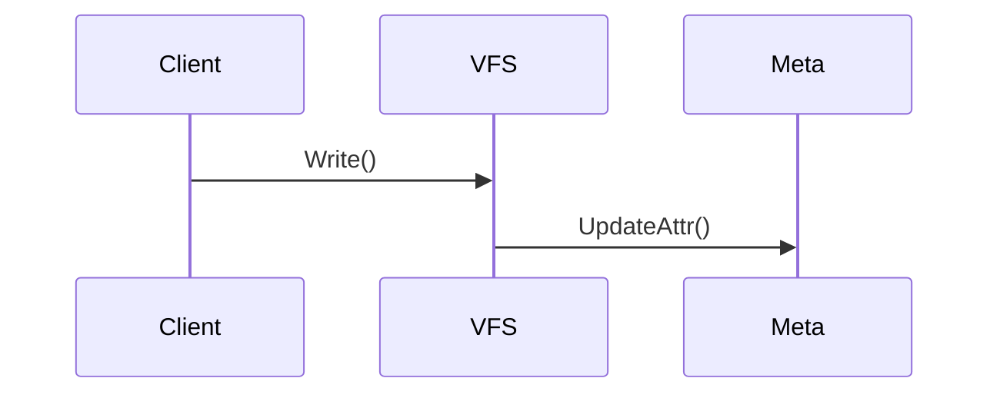

# Claude Code Skills for Source Code Analysis

本仓库包含一套 Claude Code Skills，用于自动化源码分析工作。

## Skills 列表

| Skill | 命令 | 用途 |
|:------|:-----|:-----|
| **完整源码分析** | `/analyze-source <仓库路径>` | 对项目进行全面深入分析，生成完整笔记 |
| **快速分析** | `/quick-analyze <仓库路径>` | 快速生成核心笔记框架 |
| **模块分析** | `/analyze-module <仓库> <模块>` | 深度分析单个模块 |
| **流程分析** | `/analyze-flow <仓库> <流程名>` | 追踪关键执行流程 |
| **系统设计哲学** | `/analyze-design-philosophy <笔记目录>` | 分析系统设计哲学（7个维度） |
| **提取亮点** | `/extract-highlights <仓库>` | 提取设计亮点 |
| **生成面试题** | `/generate-interview <笔记目录>` | 生成面试题库 |
| **更新索引** | `/update-index` | 更新主 README 项目列表 |

## 使用示例

### 1. 完整分析一个新项目

```bash
/analyze-source /home/user/projects/my-repo
```

这将：
- 探索仓库结构，识别项目类型和语言
- 分析架构和核心模块
- 追踪 3-5 个关键执行流程
- 分析系统设计哲学（不变量、控制面/数据面等）
- 生成完整的笔记目录结构

### 2. 快速开始

```bash
/quick-analyze /home/user/projects/my-repo
```

生成基础框架（README + reading-guide），后续可以逐步完善。

### 3. 深入分析特定模块

```bash
/analyze-module /home/user/projects/my-repo pkg/core
```

### 4. 追踪关键流程

```bash
/analyze-flow /home/user/projects/my-repo write
```

### 5. 系统设计哲学分析

```bash
/analyze-design-philosophy Storage/JuiceFS
```

分析 7 个维度：
- 不变量分析 (invariants.md)
- 控制面与数据面分离 (control-data-plane.md)
- 闭环设计 (reconcile-loops.md)
- 扩展点设计 (extension-points.md)
- 演进策略 (evolution-strategy.md)
- 反模式识别 (anti-patterns.md)
- 真相之源分析 (sot-analysis.md)

### 6. 生成面试题

```bash
/generate-interview Storage/JuiceFS
```

### 7. 更新项目索引

```bash
/update-index
```

## 输出规范

所有 Skills 遵循统一的输出规范：

### 源码位置引用
```
`pkg/meta/interface.go:116`
```

### Mermaid 流程图


### 代码片段
```go
// 文件位置: pkg/chunk/store.go:42
func (s *Store) Read(key string) ([]byte, error) {
    // 关键实现...
}
```

## 笔记目录结构

```
[Category]/[ProjectName]/
├── README.md              # 项目概览、架构图、核心结构体
├── reading-guide.md       # 快速阅读指南
├── flows/                 # 关键路径分析
│   ├── startup.md
│   ├── [flow-1].md
│   └── [flow-2].md
├── modules/               # 模块详解
│   ├── template.md
│   └── [module-name].md
├── questions.md           # 疑问与解答
├── highlights.md          # 惊艳之处
├── algorithms.md          # 关键算法
├── tradeoffs.md           # 权衡取舍
├── interview_questions.md # 面试题库
├── exercises/             # 实战练习
│   └── TASKS.md
│
│   # 系统设计哲学 (可选，适用于复杂系统)
├── invariants.md          # 不变量分析
├── control-data-plane.md  # 控制面与数据面分离
├── reconcile-loops.md     # 闭环设计
├── extension-points.md    # 扩展点设计
├── evolution-strategy.md  # 演进策略
├── anti-patterns.md       # 反模式识别
└── sot-analysis.md        # 真相之源分析
```

## 分类规则

项目按类型放入对应目录：
- `Storage/` - 存储系统（数据库、文件系统、缓存）
- `AI-Infrastructure/` - AI 基础设施（训练框架、推理引擎）
- `AI-Models/` - AI 模型实现
- `Web-Applications/` - Web 应用框架
- `DevTools-IDE/` - 开发工具和 IDE
- `Books/` - 技术书籍笔记

## 模板

所有模板位于 `00-TEMPLATE/` 目录：
- `README.md` - 项目概览模板
- `questions.md` - Q&A 模板
- `highlights.md` - 惊艳之处模板
- `algorithms.md` - 算法模板
- `tradeoffs.md` - 权衡取舍模板
- `modules/template.md` - 模块分析模板
- `invariants.md` - 不变量分析模板
- `control-data-plane.md` - 控制面/数据面模板
- `reconcile-loops.md` - 闭环设计模板
- `extension-points.md` - 扩展点模板
- `evolution-strategy.md` - 演进策略模板
- `anti-patterns.md` - 反模式模板
- `sot-analysis.md` - 真相之源模板

## 自定义

可以修改 `.claude/commands/` 下的 skill 文件来调整分析流程和输出格式。

## 参考

- [Anthropic Skills 官方文档](https://www.anthropic.com/engineering/equipping-agents-for-the-real-world-with-agent-skills)
- [Anthropic Skills 仓库](https://github.com/anthropics/skills)
