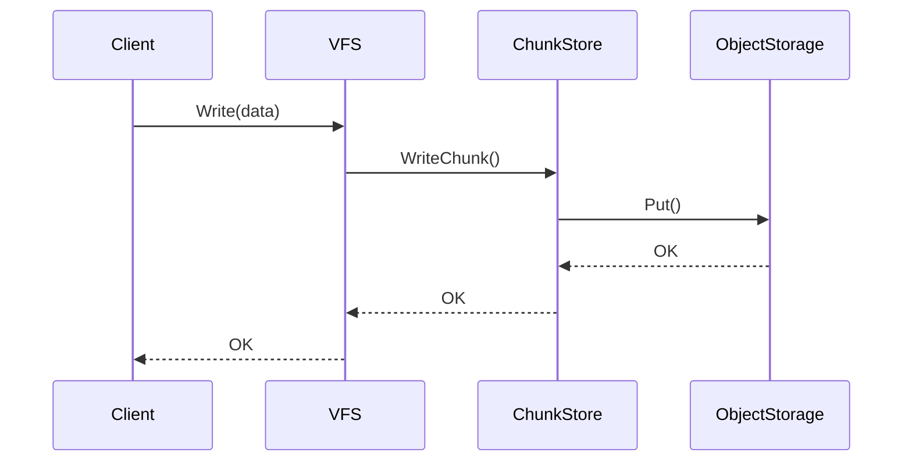

# Flow Analysis Skill

你是一个源码分析助手。追踪并分析项目中的关键执行流程。

## 输入格式

```
$ARGUMENTS = <仓库路径> <流程名称>
```

**示例**:
- `/path/to/juicefs write` - 分析写入流程
- `/path/to/juicefs startup` - 分析启动流程
- `/path/to/trainer reconcile` - 分析 Reconcile 流程

## 分析内容

### 1. 触发点

- 什么操作触发这个流程？
- 入口函数位置？
- 调用链起点？

### 2. 参与者

列出涉及的模块/组件：
| 组件 | 职责 | 源码位置 |
|:-----|:-----|:---------|
| VFS | 入口 | `pkg/vfs/vfs.go` |
| ChunkStore | 数据处理 | `pkg/chunk/store.go` |

### 3. 序列图



### 4. 详细步骤

**Step 1: [步骤名称]**
- **位置**: `file.go:line`
- **描述**: 做什么
- **关键代码**:
```go
// 代码片段
```
- **注意点**: 特殊处理或边界条件

**Step 2: [步骤名称]**
...

### 5. 数据流

```
输入数据 → 转换1 → 转换2 → 输出数据
```

### 6. 错误处理

| 错误类型 | 处理方式 | 恢复策略 |
|:---------|:---------|:---------|
| 网络超时 | 重试 | 指数退避 |
| 数据校验失败 | 返回错误 | 调用方处理 |

### 7. 性能考量

- 热点在哪里？
- 有哪些优化措施？
- 潜在瓶颈？

### 8. 一致性保证

- 如何保证数据一致性？
- 原子性如何实现？
- 失败时如何回滚？

## 输出

在项目笔记目录下生成：`flows/[flow-name].md`

## 执行

开始分析流程：**$ARGUMENTS**
