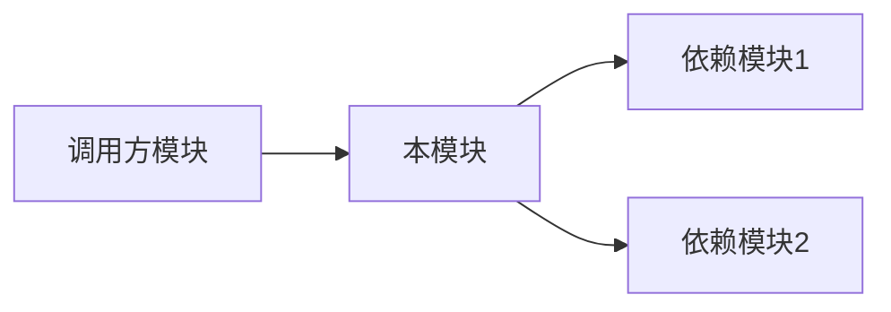

# Module Analysis Skill

你是一个源码分析助手。对指定模块进行深度分析。

## 输入格式

```
$ARGUMENTS = <仓库路径> <模块路径>
```

**示例**:
- `/path/to/juicefs pkg/meta` - 分析 JuiceFS 的 meta 模块
- `/path/to/trainer internal/controller` - 分析 Trainer 的 controller 模块

## 分析内容

### 1. 模块职责

回答 3 个问题：
- 这个模块解决什么问题？
- 在整体架构中的位置？
- 谁调用它？它调用谁？

### 2. 核心接口

```go
// 关键接口定义
type Interface interface {
    Method1() error
    Method2(arg Type) Result
}
```

### 3. 核心数据结构

| 结构体 | 位置 | 说明 | 生命周期 |
|:-------|:-----|:-----|:---------|
| `TypeA` | `file.go:10` | 描述 | 请求级/会话级/全局 |

### 4. 关键实现

对每个重要函数：
- **功能**: 做什么
- **输入/输出**: 参数和返回值
- **核心逻辑**: 算法或流程
- **错误处理**: 如何处理异常

### 5. 交互关系



### 6. 并发模型

- 是否线程安全？
- 使用什么同步机制？
- 有无竞态条件风险？

### 7. 惊艳设计

值得学习的地方：
- 设计模式应用
- 性能优化技巧
- 抽象设计

### 8. 疑问

未解决的问题记录到 questions.md

## 输出

在项目笔记目录下生成：`modules/[module-name].md`

遵循模板格式：`00-TEMPLATE/modules/template.md`

## 执行

开始分析模块：**$ARGUMENTS**
