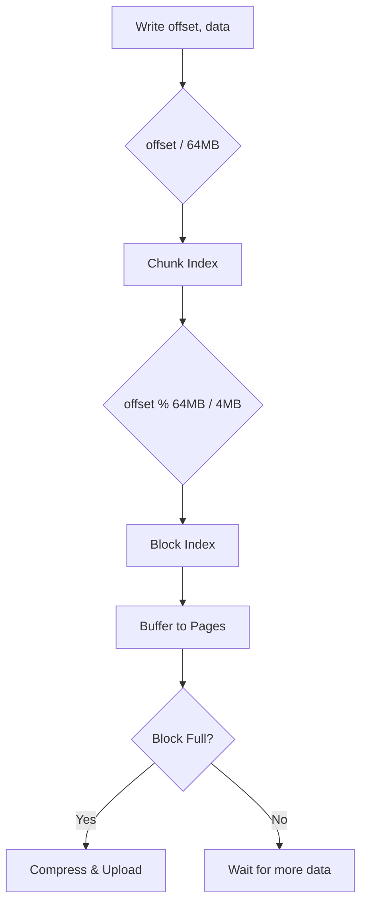
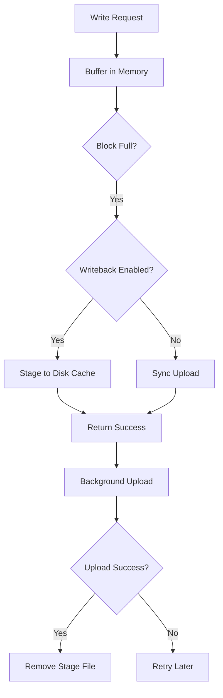

# JuiceFS 关键算法 (Key Algorithms)

> 记录 JuiceFS 中使用的核心算法，包括其原理、复杂度、实现细节和应用场景。

---

## Algorithm 1: Singleflight (请求合并)

### 分类
并发控制

### 问题定义
多个 goroutine 同时请求同一个 Key 的数据时，如何避免重复执行相同的操作？

### 核心思想
使用 Map + WaitGroup：第一个请求执行实际操作，后续请求等待并共享结果。

### 算法描述

**输入**: Key (string), 执行函数 fn
**输出**: 执行结果 (共享)

**步骤**:
1. 加锁检查 Key 是否已在处理中
2. 若是，增加等待计数，解锁，等待 WaitGroup
3. 若否，创建 request，加入 Map，解锁，执行 fn
4. 执行完成后，为所有等待者增加引用计数
5. 从 Map 中删除 Key，通知所有等待者

### 伪代码
```
function Execute(key, fn):
    lock()
    if key in requests:
        requests[key].dups++
        unlock()
        wait(requests[key].wg)
        return requests[key].result

    req = new Request()
    req.wg.Add(1)
    requests[key] = req
    unlock()

    req.result = fn()

    lock()
    for i in range(req.dups):
        req.result.Acquire()  // 引用计数
    delete(requests, key)
    unlock()

    req.wg.Done()
    return req.result
```

### 复杂度分析
- **时间复杂度**: O(1) 平均（哈希表操作）
- **空间复杂度**: O(k) 其中 k 是并发请求的不同 Key 数量

### 实现代码
```go
// pkg/chunk/singleflight.go:39-65
func (con *Controller) Execute(key string, fn func() (*Page, error)) (*Page, error) {
    con.Lock()
    if c, ok := con.rs[key]; ok {
        c.dups++
        con.Unlock()
        c.wg.Wait()
        return c.val, c.err
    }
    c := new(request)
    c.wg.Add(1)
    con.rs[key] = c
    con.Unlock()

    c.val, c.err = fn()

    con.Lock()
    for i := 0; i < c.dups; i++ {
        c.val.Acquire()
    }
    delete(con.rs, key)
    con.Unlock()

    c.wg.Done()
    return c.val, c.err
}
```

### 优缺点
**优点**:
- 实现简单，代码量少
- 无锁等待（WaitGroup）
- 适合读多写少场景

**缺点**:
- 不支持超时取消
- 所有等待者共享同一个错误

### 相关算法对比
| 算法 | 实现复杂度 | 超时支持 | 取消支持 |
|:-----|:-----------|:---------|:---------|
| Singleflight (JuiceFS) | 低 | 无 | 无 |
| Singleflight (golang.org/x) | 中 | 无 | 无 |
| Async Singleflight | 高 | 有 | 有 |

---

## Algorithm 2: Chunk 分块算法

### 分类
数据结构 / 分片策略

### 问题定义
如何将大文件切分为适合对象存储的小块，同时支持随机读写？

### 核心思想
三级分层：Chunk (64MB) → Block (4MB) → Page (64KB)

### 算法描述

**文件偏移 → 存储位置映射**:
```
chunk_index = offset / ChunkSize        // 64MB
block_index = (offset % ChunkSize) / BlockSize  // 4MB
block_offset = offset % BlockSize
```

**对象存储 Key 生成**:
```
// 普通模式
key = "chunks/{slice_id/1M}/{slice_id/1K}/{slice_id}_{block_idx}_{block_size}"

// HashPrefix 模式 (更均匀分布)
key = "chunks/{slice_id%256:02X}/{slice_id/1M}/{slice_id}_{block_idx}_{block_size}"
```

### 流程图



### 复杂度分析
- **定位**: O(1) - 纯算术运算
- **写入**: O(n) - n 为数据大小
- **空间放大**: 最坏 4MB（最后一个块不足一块大小）

### 实现代码
```go
// pkg/chunk/cached_store.go:73-78
func (s *rSlice) key(indx int) string {
    if s.store.conf.HashPrefix {
        return fmt.Sprintf("chunks/%02X/%v/%v_%v_%v",
            s.id%256, s.id/1000/1000, s.id, indx, s.blockSize(indx))
    }
    return fmt.Sprintf("chunks/%v/%v/%v_%v_%v",
        s.id/1000/1000, s.id/1000, s.id, indx, s.blockSize(indx))
}

// pkg/chunk/cached_store.go:80-83
func (s *rSlice) index(off int) int {
    return off / s.store.conf.BlockSize
}
```

### 参数选择理由
| 参数 | 值 | 理由 |
|:-----|:---|:-----|
| ChunkSize | 64MB | 元数据数量与效率的平衡 |
| BlockSize | 4MB | 对象存储最佳上传大小 |
| PageSize | 64KB | 内存分配效率（与 OS 页大小对齐） |

---

## Algorithm 3: 二进制属性序列化

### 分类
压缩/编码

### 问题定义
如何高效地序列化文件属性（Attr）以存储在 Redis 中？

### 核心思想
使用大端字节序的固定格式二进制编码，避免 JSON/Protobuf 的开销。

### 算法描述

**序列化格式** (64-80 bytes):
```
| Offset | Size | Field      | Encoding     |
|--------|------|------------|--------------|
| 0      | 1    | Flags      | uint8        |
| 1      | 2    | Mode+Type  | uint16 BE    |  // Type 在高 4 位
| 3      | 4    | Uid        | uint32 BE    |
| 7      | 4    | Gid        | uint32 BE    |
| 11     | 8    | Atime      | int64 BE     |
| 19     | 4    | Atimensec  | uint32 BE    |
| 23     | 8    | Mtime      | int64 BE     |
| 31     | 4    | Mtimensec  | uint32 BE    |
| 35     | 8    | Ctime      | int64 BE     |
| 43     | 4    | Ctimensec  | uint32 BE    |
| 47     | 4    | Nlink      | uint32 BE    |
| 51     | 8    | Length     | uint64 BE    |
| 59     | 4    | Rdev       | uint32 BE    |
| 63     | 8    | Parent     | uint64 BE    |
| 71     | 4    | AccessACL  | uint32 BE    |  // 可选
| 75     | 4    | DefaultACL | uint32 BE    |  // 可选
```

### 复杂度分析
- **序列化**: O(1) - 固定字段数
- **空间**: 64-80 字节（vs JSON ~200+ 字节）

### 实现代码
```go
// pkg/meta/interface.go:178-204
func (attr *Attr) Marshal() []byte {
    size := uint32(36 + 24 + 4 + 8)
    if attr.AccessACL|attr.DefaultACL != aclAPI.None {
        size += 8
    }
    w := utils.NewBuffer(size)
    w.Put8(attr.Flags)
    w.Put16((uint16(attr.Typ) << 12) | (attr.Mode & 0xfff))
    w.Put32(attr.Uid)
    w.Put32(attr.Gid)
    w.Put64(uint64(attr.Atime))
    w.Put32(attr.Atimensec)
    // ...
    return w.Bytes()
}
```

### 优缺点
**优点**:
- 极小的空间开销
- 解析速度快（无需解析）
- 跨语言兼容（只要遵循格式）

**缺点**:
- 不可读（调试困难）
- 版本兼容需要特殊处理
- 字段顺序固定

---

## Algorithm 4: LRU 缓存淘汰

### 分类
缓存

### 问题定义
磁盘缓存空间有限时，如何决定淘汰哪些数据块？

### 核心思想
结合 LRU (Least Recently Used) 和空间限制，优先淘汰最久未访问的块。

### 算法描述

JuiceFS 的缓存淘汰策略：
1. 维护所有缓存块的访问时间
2. 当缓存空间超过限制时，按访问时间排序
3. 从最旧的开始删除，直到空间足够或达到最低保留量

### 实现要点
```go
// pkg/chunk/cache_eviction.go (概念代码)
func (c *diskCache) evict() {
    files := c.listCachedFiles()
    sort.Slice(files, func(i, j int) bool {
        return files[i].Mtime.Before(files[j].Mtime)
    })

    for _, f := range files {
        if c.usedSpace < c.maxSpace * 0.9 {
            break
        }
        c.remove(f)
    }
}
```

### 复杂度分析
- **查找淘汰候选**: O(n log n) - 排序
- **单次淘汰**: O(1)

---

## Algorithm 5: 预读算法 (Prefetch)

### 分类
缓存 / 预测

### 问题定义
如何预测用户的读取模式，提前加载数据以隐藏延迟？

### 核心思想
检测顺序读模式，提前异步加载后续块。

### 算法描述

**窗口滑动预读**:
1. 记录最近 N 次读取的位置
2. 如果检测到顺序访问模式（位置递增）
3. 启动后台任务预读后续 M 个块
4. 控制并发预读数量，避免带宽竞争

### 伪代码
```
function onRead(offset, length):
    block_idx = offset / BlockSize

    if isSequential(block_idx, recent_reads):
        prefetch_count = min(configured_prefetch, max_concurrent - current_prefetch)
        for i in range(1, prefetch_count + 1):
            spawn async:
                loadBlock(block_idx + i)

    recent_reads.append(block_idx)
    if len(recent_reads) > WINDOW_SIZE:
        recent_reads.pop(0)
```

### 实现位置
`pkg/chunk/prefetch.go`

### 参数调优
| 参数 | 默认值 | 影响 |
|:-----|:-------|:-----|
| Prefetch 数量 | 1-3 | 越大越激进，但可能浪费带宽 |
| 窗口大小 | 4-8 | 检测顺序读的敏感度 |
| 并发限制 | 10 | 防止带宽竞争 |

---

## Algorithm 6: Writeback 异步上传

### 分类
I/O 优化

### 问题定义
如何提升写入性能，同时保证数据最终一致性？

### 核心思想
先写本地磁盘缓存（Stage），后台异步上传到对象存储。

### 流程图



### 复杂度分析
- **写入延迟**: O(磁盘写入) << O(对象存储上传)
- **空间代价**: 需要额外磁盘空间作为 staging area

### 实现代码
```go
// pkg/chunk/cached_store.go:420-458
if s.writeback && blen < s.store.conf.WritebackThresholdSize {
    stagingPath, err := s.store.bcache.stage(key, block.Data)
    if err == nil {
        s.errors <- nil  // 立即返回成功
        // 后台异步上传
        s.store.addDelayedStaging(key, stagingPath, time.Now(), false)
        return
    }
}
// 否则同步上传
s.errors <- s.store.upload(key, block, s)
```

### 故障恢复
- 客户端重启后扫描 staging 目录
- 重新上传未完成的文件
- 上传成功后删除 stage 文件

---

## 算法总结表

| 算法 | 分类 | 核心场景 | 时间复杂度 | 空间复杂度 |
|:-----|:-----|:---------|:-----------|:-----------|
| Singleflight | 并发控制 | 缓存击穿防护 | O(1) | O(k) |
| Chunk 分块 | 数据分片 | 大文件存储 | O(1) 定位 | O(1) 放大 |
| 二进制序列化 | 编码 | 元数据存储 | O(1) | 64-80B |
| LRU 缓存淘汰 | 缓存 | 空间管理 | O(n log n) | O(n) |
| 预读算法 | 预测 | 顺序读优化 | O(1) | O(窗口大小) |
| Writeback | I/O 优化 | 写入加速 | O(磁盘) | O(staging) |
