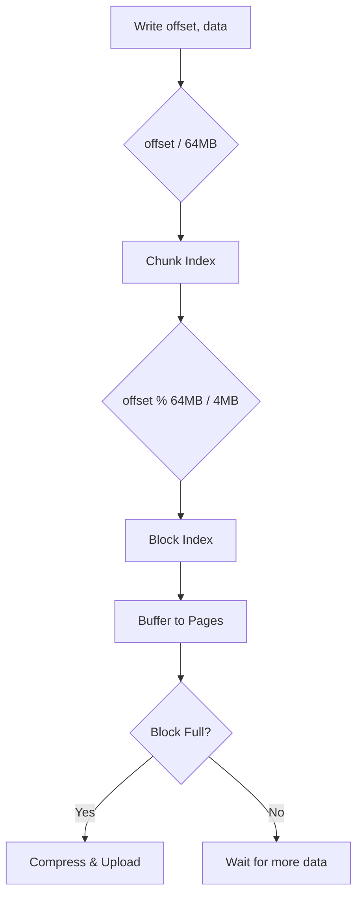
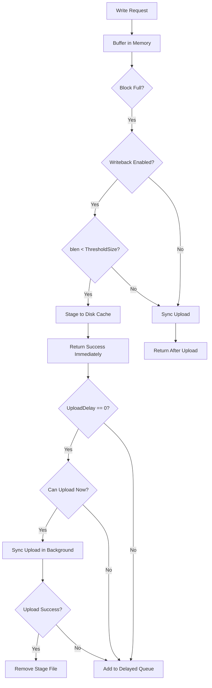

# JuiceFS 关键算法 (Key Algorithms)

> 记录 JuiceFS 中使用的核心算法，包括其原理、复杂度、实现细节和应用场景。

---

## Algorithm 1: Singleflight (请求合并)

### 分类
并发控制

### 问题定义
多个 goroutine 同时请求同一个 Key 的数据时，如何避免重复执行相同的操作？

### 核心思想
使用 Map + WaitGroup：第一个请求执行实际操作，后续请求等待并共享结果。

### 算法描述

**输入**: Key (string), 执行函数 fn
**输出**: 执行结果 (共享)

**步骤**:
1. 加锁检查 Key 是否已在处理中
2. 若是，增加等待计数，解锁，等待 WaitGroup
3. 若否，创建 request，加入 Map，解锁，执行 fn
4. 执行完成后，为所有等待者增加引用计数
5. 从 Map 中删除 Key，通知所有等待者

### 伪代码
```
function Execute(key, fn):
    lock()
    if key in requests:
        requests[key].dups++
        unlock()
        wait(requests[key].wg)
        return requests[key].result

    req = new Request()
    req.wg.Add(1)
    requests[key] = req
    unlock()

    req.result = fn()

    lock()
    for i in range(req.dups):
        req.result.Acquire()  // 引用计数
    delete(requests, key)
    unlock()

    req.wg.Done()
    return req.result
```

### 复杂度分析
- **时间复杂度**: O(1) 平均（哈希表操作）
- **空间复杂度**: O(k) 其中 k 是并发请求的不同 Key 数量

### 实现代码
```go
// pkg/chunk/singleflight.go:39-65
func (con *Controller) Execute(key string, fn func() (*Page, error)) (*Page, error) {
    con.Lock()
    if c, ok := con.rs[key]; ok {
        c.dups++
        con.Unlock()
        c.wg.Wait()
        return c.val, c.err
    }
    c := new(request)
    c.wg.Add(1)
    con.rs[key] = c
    con.Unlock()

    c.val, c.err = fn()

    con.Lock()
    for i := 0; i < c.dups; i++ {
        c.val.Acquire()
    }
    delete(con.rs, key)
    con.Unlock()

    c.wg.Done()
    return c.val, c.err
}
```

### 优缺点
**优点**:
- 实现简单，代码量少
- 无锁等待（WaitGroup）
- 适合读多写少场景

**缺点**:
- 不支持超时取消
- 所有等待者共享同一个错误

### 相关算法对比
| 算法 | 实现复杂度 | 超时支持 | 取消支持 |
|:-----|:-----------|:---------|:---------|
| Singleflight (JuiceFS) | 低 | 无 | 无 |
| Singleflight (golang.org/x) | 中 | 无 | 无 |
| Async Singleflight | 高 | 有 | 有 |

---

## Algorithm 2: Chunk 分块算法

### 分类
数据结构 / 分片策略

### 问题定义
如何将大文件切分为适合对象存储的小块，同时支持随机读写？

### 核心思想
三级分层：Chunk (64MB) → Block (4MB) → Page (64KB)

### 算法描述

**文件偏移 → 存储位置映射**:
```
chunk_index = offset / ChunkSize        // 64MB
block_index = (offset % ChunkSize) / BlockSize  // 4MB
block_offset = offset % BlockSize
```

**对象存储 Key 生成**:
```
// 普通模式
key = "chunks/{slice_id/1M}/{slice_id/1K}/{slice_id}_{block_idx}_{block_size}"

// HashPrefix 模式 (更均匀分布)
key = "chunks/{slice_id%256:02X}/{slice_id/1M}/{slice_id}_{block_idx}_{block_size}"
```

### 流程图



### 复杂度分析
- **定位**: O(1) - 纯算术运算
- **写入**: O(n) - n 为数据大小
- **空间放大**: 最坏 4MB（最后一个块不足一块大小）

### 实现代码
```go
// pkg/chunk/cached_store.go:73-78
func (s *rSlice) key(indx int) string {
    if s.store.conf.HashPrefix {
        return fmt.Sprintf("chunks/%02X/%v/%v_%v_%v",
            s.id%256, s.id/1000/1000, s.id, indx, s.blockSize(indx))
    }
    return fmt.Sprintf("chunks/%v/%v/%v_%v_%v",
        s.id/1000/1000, s.id/1000, s.id, indx, s.blockSize(indx))
}

// pkg/chunk/cached_store.go:80-83
func (s *rSlice) index(off int) int {
    return off / s.store.conf.BlockSize
}
```

### 参数选择理由
| 参数 | 值 | 理由 |
|:-----|:---|:-----|
| ChunkSize | 64MB | 元数据数量与效率的平衡 |
| BlockSize | 4MB | 对象存储最佳上传大小 |
| PageSize | 64KB | 内存分配效率（与 OS 页大小对齐） |

---

## Algorithm 3: 二进制属性序列化

### 分类
压缩/编码

### 问题定义
如何高效地序列化文件属性（Attr）以存储在 Redis 中？

### 核心思想
使用大端字节序的固定格式二进制编码，避免 JSON/Protobuf 的开销。

### 算法描述

**序列化格式** (64-80 bytes):
```
| Offset | Size | Field      | Encoding     |
|--------|------|------------|--------------|
| 0      | 1    | Flags      | uint8        |
| 1      | 2    | Mode+Type  | uint16 BE    |  // Type 在高 4 位
| 3      | 4    | Uid        | uint32 BE    |
| 7      | 4    | Gid        | uint32 BE    |
| 11     | 8    | Atime      | int64 BE     |
| 19     | 4    | Atimensec  | uint32 BE    |
| 23     | 8    | Mtime      | int64 BE     |
| 31     | 4    | Mtimensec  | uint32 BE    |
| 35     | 8    | Ctime      | int64 BE     |
| 43     | 4    | Ctimensec  | uint32 BE    |
| 47     | 4    | Nlink      | uint32 BE    |
| 51     | 8    | Length     | uint64 BE    |
| 59     | 4    | Rdev       | uint32 BE    |
| 63     | 8    | Parent     | uint64 BE    |
| 71     | 4    | AccessACL  | uint32 BE    |  // 可选
| 75     | 4    | DefaultACL | uint32 BE    |  // 可选
```

### 复杂度分析
- **序列化**: O(1) - 固定字段数
- **空间**: 64-80 字节（vs JSON ~200+ 字节）

### 实现代码
```go
// pkg/meta/interface.go:178-204
func (attr *Attr) Marshal() []byte {
    size := uint32(36 + 24 + 4 + 8)
    if attr.AccessACL|attr.DefaultACL != aclAPI.None {
        size += 8
    }
    w := utils.NewBuffer(size)
    w.Put8(attr.Flags)
    w.Put16((uint16(attr.Typ) << 12) | (attr.Mode & 0xfff))
    w.Put32(attr.Uid)
    w.Put32(attr.Gid)
    w.Put64(uint64(attr.Atime))
    w.Put32(attr.Atimensec)
    // ...
    return w.Bytes()
}
```

### 优缺点
**优点**:
- 极小的空间开销
- 解析速度快（无需解析）
- 跨语言兼容（只要遵循格式）

**缺点**:
- 不可读（调试困难）
- 版本兼容需要特殊处理
- 字段顺序固定

---

## Algorithm 4: 缓存淘汰策略

### 分类
缓存

### 问题定义
磁盘缓存空间有限时，如何决定淘汰哪些数据块？

### 核心思想
JuiceFS 提供三种淘汰策略，通过 `KeyIndex` 接口抽象：

### 三种策略对比

| 策略 | 名称 | 数据结构 | 淘汰复杂度 | 适用场景 |
|:-----|:-----|:---------|:-----------|:---------|
| `none` | 无淘汰 | HashMap | N/A | 缓存永不过期 |
| `2-random` | 随机采样 | HashMap | O(1) | 内存敏感场景 |
| `lru` | 最近最少使用 | HashMap + MinHeap | O(log n) | 热点数据明显 |

### 算法描述

#### 策略 1: noneEviction
```go
// pkg/chunk/cache_eviction.go:73-133
type noneEviction struct {
    keys map[cacheKey]cacheItem
}
// 只做记录，不支持淘汰
func (p *noneEviction) evictionIter() { panic("not implemented") }
```

#### 策略 2: randomEviction (2-Random)
```go
// pkg/chunk/cache_eviction.go:135-183
type randomEviction struct {
    noneEviction
    cacheExpire time.Duration
}

func (p *randomEviction) evictionIter() func(yield func(...) bool) {
    return func(yield func(...) bool) {
        var cnt int
        var lastK cacheKey
        var lastValue cacheItem
        var cutoff = now - uint32(p.cacheExpire/time.Second)

        for k, value := range p.keys {
            if value.size < 0 { continue }  // skip staging
            // 优先淘汰过期的，否则选择较旧的
            if p.cacheExpire > 0 && value.atime < cutoff {
                lastK, lastValue = k, value
            } else if cnt == 0 || lastValue.atime > value.atime {
                lastK, lastValue = k, value
            }
            cnt++
            if cnt > 1 {  // 每遍历 2 个，淘汰 1 个较旧的
                delete(p.keys, lastK)
                yield(lastK, lastValue)
                cnt = 0
            }
        }
    }
}
```
**核心思想**: 每遍历 2 个元素，选择较旧的一个淘汰（2-Random Selection）

#### 策略 3: lruEviction (MinHeap LRU)
```go
// pkg/chunk/cache_eviction.go:185-332
type lruEviction struct {
    keys    map[cacheKey]*lruItem
    lruHeap atimeHeap  // 最小堆，按 atime 排序
}

type atimeHeap []heapItem

func (h atimeHeap) Less(i, j int) bool {
    if h[i].atime != h[j].atime {
        return h[i].atime < h[j].atime  // 最早访问的在堆顶
    }
    return h[i].size > h[j].size  // 同 atime 优先淘汰大块
}

func (p *lruEviction) get(key cacheKey) *cacheItem {
    if iter, ok := p.keys[key]; ok {
        iter.atime = uint32(time.Now().Unix())  // 更新访问时间
        heap.Fix(&p.lruHeap, iter.pos)          // 重新堆化
        return &iter.cacheItem
    }
    return nil
}

func (p *lruEviction) evictionIter() func(yield func(...) bool) {
    return func(yield func(...) bool) {
        for p.lruHeap.Len() > 0 {
            item := heap.Pop(&p.lruHeap).(heapItem)  // O(log n)
            delete(p.keys, *item.key)
            yield(*item.key, item.cacheItem)
        }
    }
}
```

### 复杂度分析
| 操作 | none | 2-random | lru |
|:-----|:-----|:---------|:----|
| add | O(1) | O(1) | O(log n) |
| get | O(1) | O(1) | O(log n) |
| remove | O(1) | O(1) | O(log n) |
| evict | N/A | O(1) | O(log n) |

### 配置方式
```bash
juicefs mount --cache-eviction lru meta://... /mnt/jfs
```

---

## Algorithm 5: 预读算法 (Prefetcher Worker Pool)

### 分类
缓存 / 预测 / 并发控制

### 问题定义
如何提前加载数据块，隐藏对象存储的访问延迟？

### 核心思想
使用 Worker Pool + Channel + Map 实现并发受限的异步预读。

### 架构设计

```
┌─────────────────────────────────────────────────────┐
│                    prefetcher                        │
├─────────────────────────────────────────────────────┤
│  pending chan ─────┬──────┬──────┬───> Worker 1     │
│  (buffer=10)       │      │      │                  │
│                    │      │      └───> Worker 2     │
│                    │      │                         │
│  busy map ─────────┘      └──────────> Worker N     │
│  (去重)                                             │
└─────────────────────────────────────────────────────┘
```

### 实现代码
```go
// pkg/chunk/prefetch.go:23-63
type prefetcher struct {
    sync.Mutex
    pending chan string       // 任务队列（带缓冲）
    busy    map[string]bool   // 正在处理的 key（去重）
    op      func(key string)  // 实际的预读函数
}

func newPrefetcher(parallel int, fetch func(string)) *prefetcher {
    p := &prefetcher{
        pending: make(chan string, 10),  // 最多缓冲 10 个任务
        busy:    make(map[string]bool),
        op:      fetch,
    }
    // 启动 parallel 个 worker
    for i := 0; i < parallel; i++ {
        go p.do()
    }
    return p
}

func (p *prefetcher) do() {
    for key := range p.pending {  // 阻塞等待任务
        p.op(key)                 // 执行预读

        p.Lock()
        delete(p.busy, key)       // 完成后从 busy 移除
        p.Unlock()
    }
}

func (p *prefetcher) fetch(key string) {
    p.Lock()
    defer p.Unlock()
    if _, ok := p.busy[key]; ok {
        return  // 已在处理中，跳过
    }
    select {
    case p.pending <- key:        // 非阻塞发送
        p.busy[key] = true
    default:                      // channel 满，直接丢弃
    }
}
```

### 触发时机
```go
// pkg/chunk/cached_store.go:743
// 成功读取一个块后，触发下一个块的预读
store.fetcher.fetch(key)
```

### 关键设计
| 特性 | 实现方式 | 作用 |
|:-----|:---------|:-----|
| 并发限制 | 固定 worker 数量 | 防止带宽竞争 |
| 去重 | `busy` map | 避免重复预读同一块 |
| 非阻塞 | `select + default` | 任务队列满时直接丢弃 |
| 背压 | channel buffer=10 | 控制待处理任务数量 |

### 复杂度分析
- **提交任务**: O(1)
- **空间复杂度**: O(parallel + 10 + busy_count)

### 配置方式
```bash
juicefs mount --prefetch 3 meta://... /mnt/jfs
```

---

## Algorithm 6: Writeback 异步上传

### 分类
I/O 优化 / 写入加速

### 问题定义
如何提升写入性能，同时保证数据最终持久化？

### 核心思想
先写本地磁盘（Stage），后台异步上传到对象存储，写入延迟从 "网络" 降到 "磁盘"。

### 流程图



### 实现代码
```go
// pkg/chunk/cached_store.go:420-464
func (s *wSlice) upload(indx int) {
    // ... 构建 block 数据 ...

    if s.writeback && blen < s.store.conf.WritebackThresholdSize {
        stagingPath := "unknown"
        stageFailed := false
        block.Acquire()

        // 带超时的写入本地缓存（5分钟）
        err := utils.WithTimeout(context.TODO(), func(ctx context.Context) error {
            defer block.Release()
            stagingPath, err = s.store.bcache.stage(key, block.Data)
            if err == nil && stageFailed {
                _ = s.store.bcache.removeStage(key)  // 超时后成功的处理
            }
            return err
        }, s.store.conf.PutTimeout)

        if err != nil {
            stageFailed = true
            logger.Warnf("write %s to disk: %s, upload directly", key, err)
        } else {
            s.errors <- nil  // 立即返回成功！

            // 决定是立即上传还是延迟上传
            if s.store.conf.UploadDelay == 0 && s.store.canUpload() {
                select {
                case s.store.currentUpload <- struct{}{}:
                    defer func() { <-s.store.currentUpload }()
                    if err = s.store.upload(key, block, nil); err == nil {
                        s.store.bcache.uploaded(key, blen)
                        s.store.bcache.removeStage(key)
                    } else {
                        s.store.addDelayedStaging(key, stagingPath, time.Now(), false)
                    }
                    return
                default:
                    // 上传并发已满，加入延迟队列
                }
            }
            s.store.addDelayedStaging(key, stagingPath, time.Now(), false)
            return
        }
    }

    // 同步上传（Writeback 未启用或 Stage 失败）
    s.store.currentUpload <- struct{}{}
    defer func() { <-s.store.currentUpload }()
    s.errors <- s.store.upload(key, block, s)
}
```

### 关键配置
| 参数 | 说明 | 默认值 |
|:-----|:-----|:-------|
| `Writeback` | 是否启用 | false |
| `WritebackThresholdSize` | 最大 stage 块大小 | BlockSize + 1 |
| `UploadDelay` | 延迟上传时间 | 0 |

### 故障恢复
```go
// 客户端启动时扫描 staging 目录
func (store *cachedStore) scanDelayedStaging() {
    // 1. 遍历 staging 目录
    // 2. 对每个未上传的文件：
    //    - 解析 key
    //    - 加入延迟上传队列
    //    - 后台重试上传
}
```

### 复杂度分析
- **写入延迟**: O(磁盘写入) ≈ 1-10ms << O(对象存储) ≈ 50-500ms
- **空间代价**: staging 目录需要额外磁盘空间

### 配置方式
```bash
juicefs mount --writeback meta://... /mnt/jfs
```

---

## Algorithm 7: 分片上传 (Multipart Upload)

### 分类
I/O 优化 / 大文件传输

### 问题定义
如何高效上传大文件到对象存储？

### 核心思想
将大文件分割为多个分片并行上传，最后合并。利用 S3 Multipart Upload API。

### 接口定义
```go
// pkg/object/interface.go:49-111
type MultipartUpload struct {
    MinPartSize int      // 最小分片大小（S3: 5MB）
    MaxCount    int      // 最大分片数（S3: 10000）
    UploadID    string   // 上传会话 ID
}

type Part struct {
    Num  int     // 分片编号
    Size int     // 分片大小
    ETag string  // 分片校验值
}

type ObjectStorage interface {
    // 创建分片上传会话
    CreateMultipartUpload(ctx, key) (*MultipartUpload, error)
    // 上传单个分片
    UploadPart(ctx, key, uploadID, num, body) (*Part, error)
    // 从已有对象复制作为分片
    UploadPartCopy(ctx, key, uploadID, num, srcKey, off, size) (*Part, error)
    // 取消上传
    AbortUpload(ctx, key, uploadID)
    // 完成上传（合并分片）
    CompleteUpload(ctx, key, uploadID, parts) error
}
```

### 分片大小选择算法
```go
// pkg/sync/sync.go:661-671
func choosePartSize(upload *MultipartUpload, size int64) int64 {
    partSize := int64(upload.MinPartSize)  // 默认 5MB
    if partSize == 0 {
        partSize = defaultPartSize
    }
    // 如果分片太小导致数量超限，自动调大
    if size > partSize * int64(upload.MaxCount) {
        partSize = size / int64(upload.MaxCount)
        partSize = ((partSize-1)>>20 + 1) << 20  // 向上对齐到 MB
    }
    return partSize
}
```

### 并行上传流程
```go
// pkg/sync/sync.go:747-800 (简化)
func doCopyMultiple(src, dst ObjectStorage, key string, size int64, ...) {
    partSize := choosePartSize(upload, size)
    n := int((size-1)/partSize) + 1  // 分片数量

    parts := make([]*Part, n)
    errs := make(chan error, n)
    abort := make(chan struct{})

    // 并行上传所有分片
    for i := 0; i < n; i++ {
        go func(i int) {
            sz := partSize
            if i == n-1 {
                sz = size - int64(i)*partSize  // 最后一片可能较小
            }
            parts[i], err = doUploadPart(src, dst, key, off, sz, ...)
            errs <- err
        }(i)
    }

    // 等待所有分片完成
    for i := 0; i < n; i++ {
        if err := <-errs; err != nil {
            close(abort)
            dst.AbortUpload(ctx, key, upload.UploadID)
            return err
        }
    }

    // 合并分片
    return dst.CompleteUpload(ctx, key, upload.UploadID, parts)
}
```

### S3 实现
```go
// pkg/object/s3.go:69-77
func (s *s3client) Limits() Limits {
    return Limits{
        IsSupportMultipartUpload: true,
        IsSupportUploadPartCopy:  true,
        MinPartSize:              5 << 20,   // 5MB
        MaxPartSize:              5 << 30,   // 5GB
        MaxPartCount:             10000,
    }
}

// pkg/object/s3.go:292-303
func (s *s3client) CreateMultipartUpload(ctx, key string) (*MultipartUpload, error) {
    params := &s3.CreateMultipartUploadInput{
        Bucket:       &s.bucket,
        Key:          &key,
        StorageClass: types.StorageClass(s.sc),
    }
    resp, err := s.s3.CreateMultipartUpload(ctx, params)
    return &MultipartUpload{
        UploadID:    *resp.UploadId,
        MinPartSize: 5 << 20,
        MaxCount:    10000,
    }, nil
}
```

### 适用场景
| 文件大小 | 策略 | 原因 |
|:---------|:-----|:-----|
| < 32MB | 直接上传 | 分片开销不值得 |
| 32MB - 50GB | 5MB 分片 | 默认分片大小 |
| > 50GB | 动态分片 | 避免超过 10000 分片限制 |

### 复杂度分析
- **时间**: O(size / 带宽 / 并发数)
- **空间**: O(n) 存储分片元数据

### 错误处理
- 单个分片失败：重试 3 次
- 整体失败：调用 AbortUpload 清理已上传分片
- 网络超时：自动重试

---

## 算法总结表

| 算法 | 分类 | 核心场景 | 时间复杂度 | 空间复杂度 |
|:-----|:-----|:---------|:-----------|:-----------|
| Singleflight | 并发控制 | 缓存击穿防护 | O(1) | O(k) |
| Chunk 分块 | 数据分片 | 大文件存储 | O(1) 定位 | O(1) 放大 |
| 二进制序列化 | 编码 | 元数据存储 | O(1) | 64-80B |
| 缓存淘汰 | 缓存 | 空间管理 | O(1) ~ O(log n) | O(n) |
| 预读算法 | 预测 | 顺序读优化 | O(1) | O(parallel) |
| Writeback | I/O 优化 | 写入加速 | O(磁盘) | O(staging) |
| 分片上传 | I/O 优化 | 大文件传输 | O(size/并发) | O(n) |
