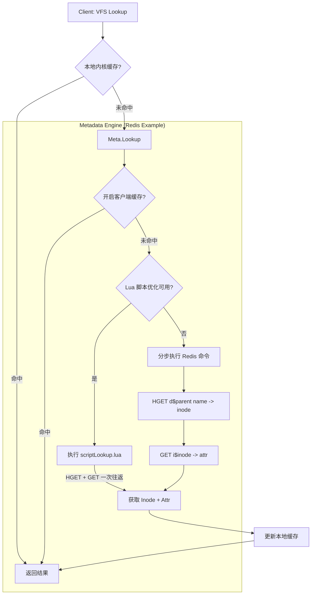

# JuiceFS 查找流程 (Lookup Path)

## 概述
`Lookup` 是文件系统最频繁的操作之一。它负责将用户看到的“路径/文件名”转化为系统内部的 `inode` 号及其属性 `attr`。在 JuiceFS 中，这一步是在元数据引擎中完成的。

## 核心流程图



## 关键技术点分析

### 1. 目录模拟 (Directory Simulation)
- **Redis Hash**: JuiceFS 使用 `d$inode` 作为 Key，文件名作为 Field。
- 这种设计允许 `O(1)` 时间复杂度的文件名查找，即使目录下有百万级文件。

### 2. 原子性与往返优化 (Lua Scripting)
- 传统的做法是先查 inode，再查属性，需要两次网络 RTT。
- JuiceFS 将此逻辑写成 Lua 脚本：
  ```lua
  local inode = redis.call('HGET', KEYS[1], ARGV[1])
  if inode then
      local attr = redis.call('GET', 'i' .. parse_inode(inode))
      return {inode, attr}
  end
  ```
- 这种优化将元数据查询性能提升了近一倍。

### 3. 客户端缓存 (Client-side Caching)
- 客户端可以配置元数据缓存（`--metacache`）。
- 缓存项包含 `cachedEntry`，记录了父目录、文件名与 inode 的映射关系。

## Rust 重写思考

1.  **Dentry Cache**:
    *   在 Rust 中实现一个高效的 LRU 缓存（如 `moka` 或 `dashmap`）。
    *   需要考虑缓存的一致性：当另一个客户端重命名了文件，本地缓存如何失效？（JuiceFS 通过超时 TTL 解决，或者在某些后端支持 Notify）。

2.  **Lua 脚本预加载**:
    *   使用 `redis-rs` 的 `Script` 类型在启动时加载脚本并获取 SHA，后续通过 `EVALSHA` 调用。

3.  **Error Handling**:
    *   如果 `Lookup` 返回 `ENOENT`，在 Rust 中应该返回一个明确的 `Option<Inode>` 或 `Result`。

4.  **Case Insensitivity**:
    *   JuiceFS 支持不区分大小写查找（`CaseInsensi`）。在 Rust 实现中，这可能涉及 `HGETALL` 并在应用层过滤，或者使用不同的 Redis Key 策略，需要权衡性能。
