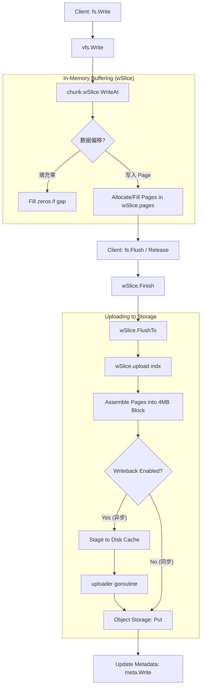

# JuiceFS 写入流程 (Write Path)

## 概述
JuiceFS 的写入是“重客户端”逻辑。客户端负责将小 IO 缓冲、聚合、压缩，最终以 Block（默认 4MB）为单位上传到对象存储。上传成功后，才通知元数据引擎。

## 核心流程图

## 关键数据结构 (`pkg/chunk/cached_store.go`)

### `wSlice` (Write Slice)
- 负责管理一个 Chunk (64MB) 的写入上下文。
- **Buffer**: `pages [][]*Page`。二维数组，第一维是 Block Index，第二维是 Page 列表。
- **State**: `uploaded` (int) 记录已上传的偏移量，防止重复上传。

### `CachedStore`
- 管理上传限速 (`upLimit`)。
- 管理后台上传队列 (`pendingCh` + `uploader` goroutine)。
- 集成压缩 (`Compressor`)。

## 详细步骤

1.  **Buffer (内存缓冲)**:
    - 用户调用 `Write` 时，数据只是拷贝到了内存中的 `Page` (64KB)。
    - 不涉及任何网络或磁盘 IO。这保证了极高的 `Write` 系统调用性能。

2.  **Flush (刷盘/上传)**:
    - 当 Page 积攒满一个 Block (4MB)，或者文件关闭时，触发 `Flush`。
    - **Block 组装**: 将零散的 Pages 拼成一个连续的字节流。
    - **压缩**: 使用 LZ4/ZSTD 压缩数据。

3.  **Writeback (回写/暂存)**:
    - 如果开启 `--writeback`，数据先写入本地磁盘缓存目录 (`Stage`)。
    - `Write` 调用立即返回成功。
    - 后台协程扫描并上传这些暂存文件。这对于大量小文件写入性能提升巨大。

4.  **Commit (元数据提交)**:
    - 只有对象存储返回 "200 OK"，客户端才会调用 `meta.Write`。
    - 这保证了元数据指向的数据一定存在。

## Rust 重写思考

1.  **Buffer Pool**: 使用 `object_pool` 或 `sharded-slab` 来管理 64KB Page，避免频繁分配。
2.  **Async/Await**: 上传逻辑天生适合 Rust 的 `Future`。
    - `Write` 接口本身是同步的 (Posix)，但内部可以 spawn 一个 Task 去处理上传。
3.  **Backpressure**: 需要实现一个限速器 (Rate Limiter) 类似于 `TokenBucket`，防止内存被写入速度撑爆（如果上传太慢）。
4.  **Failure Handling**: Writeback 模式下，如果后台上传失败怎么办？JuiceFS 的做法是重试。Rust 实现中需要设计健壮的重试队列。
