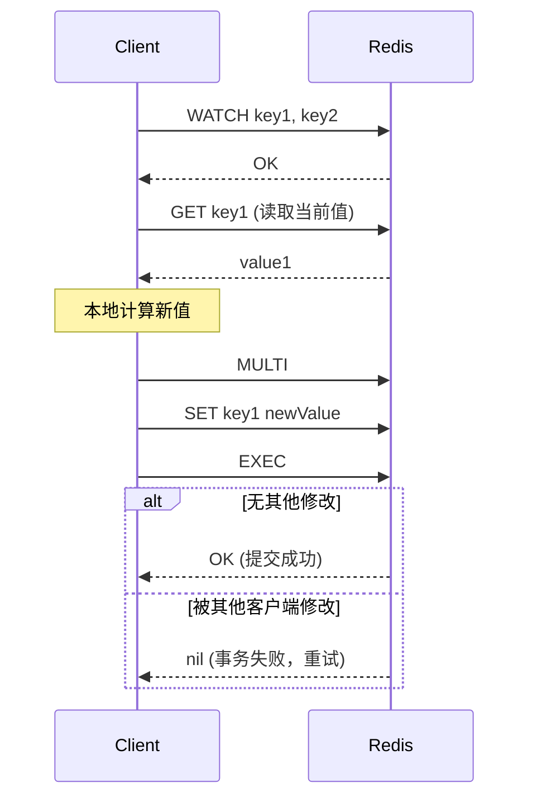

# pkg/meta 模块分析

## 职责
`pkg/meta` 是 JuiceFS 的心脏，负责管理所有的文件系统元数据。它定义了统一的 `Meta` 接口，并实现了多种数据库后端（Redis, SQL, TiKV 等）。

**源码位置**: `pkg/meta/` 目录

## 核心数据结构

### Ino (inode 标识符)
```go
// pkg/meta/interface.go:116
type Ino uint64

const RootInode Ino = 1
const TrashInode Ino = 0x7FFFFFFF10000000
```

### Attr (文件属性)
```go
// pkg/meta/interface.go:154-176
type Attr struct {
    Flags     uint8  // 文件标志
    Typ       uint8  // 类型 (TypeFile=1, TypeDirectory=2, TypeSymlink=3...)
    Mode      uint16 // 权限模式
    Uid       uint32 // 所有者 ID
    Gid       uint32 // 组 ID
    Rdev      uint32 // 设备号
    Atime     int64  // 最后访问时间
    Mtime     int64  // 最后修改时间
    Ctime     int64  // 元数据变更时间
    Atimensec uint32 // atime 纳秒部分
    Mtimensec uint32 // mtime 纳秒部分
    Ctimensec uint32 // ctime 纳秒部分
    Nlink     uint32 // 硬链接数
    Length    uint64 // 文件长度
    Parent    Ino    // 父目录 inode (硬链接时为 0)
    Full      bool   // 属性是否完整
    KeepCache bool   // 是否保持缓存
    AccessACL  uint32 // 访问 ACL ID
    DefaultACL uint32 // 默认 ACL ID
}
```

### Slice (数据切片)
```go
// pkg/meta/interface.go:314-319
type Slice struct {
    Id   uint64  // Slice 唯一 ID
    Size uint32  // 总大小
    Off  uint32  // 在 Chunk 中的偏移
    Len  uint32  // 有效长度
}
```

### Entry (目录项)
```go
// pkg/meta/interface.go:306-310
type Entry struct {
    Inode Ino
    Name  []byte
    Attr  *Attr
}
```

## 核心接口 Meta

在 `pkg/meta/interface.go:372-533` 中定义的 `Meta` 接口非常庞大，主要分为以下几类：

### 生命周期管理
| 方法 | 说明 |
|:-----|:-----|
| `Init(format *Format, force bool)` | 初始化元数据服务 |
| `Load(checkVersion bool) (*Format, error)` | 加载卷配置 |
| `Shutdown() error` | 关闭连接 |
| `Reset() error` | 清空所有元数据 (危险!) |

### 会话管理
| 方法 | 说明 |
|:-----|:-----|
| `NewSession(record bool) error` | 创建/更新客户端会话 |
| `CloseSession() error` | 关闭会话 |
| `FlushSession()` | 刷新会话状态 |
| `GetSession(sid uint64, detail bool)` | 获取会话信息 |
| `ListSessions()` | 列出所有会话 |

### 节点操作
| 方法 | 说明 |
|:-----|:-----|
| `Lookup(ctx, parent, name, inode, attr, checkPerm)` | 目录项查找 |
| `GetAttr(ctx, inode, attr)` | 获取属性 |
| `SetAttr(ctx, inode, set, sggidclearmode, attr)` | 设置属性 |
| `Mknod(ctx, parent, name, type, mode, ...)` | 创建节点 |
| `Mkdir(ctx, parent, name, mode, ...)` | 创建目录 |
| `Symlink(ctx, parent, name, path, ...)` | 创建符号链接 |
| `ReadLink(ctx, inode, path)` | 读取符号链接目标 |

### 目录操作
| 方法 | 说明 |
|:-----|:-----|
| `Readdir(ctx, inode, wantattr, entries)` | 读取目录内容 |
| `Rename(ctx, parentSrc, nameSrc, parentDst, nameDst, flags, ...)` | 重命名 |
| `Unlink(ctx, parent, name, ...)` | 删除文件 |
| `Rmdir(ctx, parent, name, ...)` | 删除空目录 |
| `Link(ctx, inodeSrc, parent, name, attr)` | 创建硬链接 |

### 数据映射 (关键!)
| 方法 | 说明 |
|:-----|:-----|
| `NewSlice(ctx, id)` | 分配新的 Slice ID |
| `Read(ctx, inode, indx, slices)` | 获取某个 Chunk 的 Slice 列表 |
| `Write(ctx, inode, indx, off, slice, mtime)` | 写入 Slice 元数据 |
| `Truncate(ctx, inode, flags, length, attr, ...)` | 截断文件 |
| `Fallocate(ctx, inode, mode, off, size, length)` | 预分配空间 |

### 锁操作
| 方法 | 说明 |
|:-----|:-----|
| `Flock(ctx, inode, owner, ltype, block)` | BSD 风格文件锁 |
| `Getlk(ctx, inode, owner, ...)` | 获取锁信息 |
| `Setlk(ctx, inode, owner, block, ...)` | POSIX 记录锁 |

## 核心实现：Redis 后端

Redis 实现 (`pkg/meta/redis.go`) 是 JuiceFS 最常用且最高效的后端之一。

### 结构体定义
```go
// pkg/meta/redis.go:90-97
type redisMeta struct {
    *baseMeta
    rdb        redis.UniversalClient
    prefix     string
    shaLookup  string // scriptLookup 的 SHA
    shaResolve string // scriptResolve 的 SHA
    cache      *redisCache
}
```

### Redis 数据布局 (完整 Schema)
来源：`pkg/meta/redis.go:57-88`

| 资源类型 | Redis 结构 | Key 格式 | Value / Field 示例 |
|:---------|:-----------|:---------|:-------------------|
| **节点属性** | String | `i$inode` | 二进制序列化的 `Attr` |
| **目录项** | Hash | `d$inode` | Field: `name`, Value: `[type(1B), inode(8B)]` |
| **父目录** | Hash | `p$inode` | Field: `parent_ino`, Value: `count` (硬链接计数) |
| **文件块** | (Binary) | `c$inode_$indx` | Slice 列表 `[{pos,id,length,off,len}]` |
| **符号链接** | String | `s$inode` | 目标路径字符串 |
| **扩展属性** | Hash | `x$inode` | Field: `name`, Value: `value` |
| **BSD 锁** | Hash | `lockf$inode` | Field: `$sid_$owner`, Value: `ltype` |
| **POSIX 锁** | Hash | `lockp$inode` | Field: `$sid_$owner`, Value: `Plock{pid,ltype,start,end}` |
| **会话列表** | Hash | `sessions` | Field: `$sid`, Value: `heartbeat` |
| **会话文件** | Set | `session$sid` | `[$inode]` (持有的文件) |
| **会话锁** | Set | `locked$sid` | `[lockf$inode, lockp$inode]` |
| **待删除文件** | ZSet | `delfiles` | Member: `$inode:$length`, Score: `seconds` |
| **分离节点** | ZSet | `detachedNodes` | Member: `$inode`, Score: `seconds` |
| **Slice 引用** | Hash | `sliceRef` | Field: `k$sliceId_$size`, Value: `refcount` |
| **目录统计** | Hash | `dirDataLength` / `dirUsedSpace` / `dirUsedInodes` | Field: `$inode`, Value: `length/space/inodes` |
| **配额** | Hash | `dirQuota` / `dirQuotaUsedSpace` / `dirQuotaUsedInodes` | Field: `$inode`, Value: `{max/used}` |
| **ACL** | Hash | `acl` | Field: `$acl_id`, Value: `acl` |

## Lua 脚本优化

### scriptLookup (pkg/meta/lua_scripts.go:20-31)
将 Lookup 操作的两次 Redis 调用合并为一次原子操作：

```lua
local buf = redis.call('HGET', KEYS[1], KEYS[2])  -- 查目录项 d$parent
if not buf then
    error("ENOENT")
end
local ino = struct.unpack(">I8", string.sub(buf, 2))  -- 解析 inode
-- double float has 52 significant bits (JS 兼容性限制)
if ino > 4503599627370495 then
    error("ENOTSUP")
end
return {ino, redis.call('GET', "i" .. string.format("%.f", ino))}  -- 返回 inode + attr
```

**启用条件（重要）**：
- 仅在 Redis **非 Cluster 前缀模式**、且 `CaseInsensi`（大小写不敏感）未开启时启用。
- 在 Redis Cluster 场景，JuiceFS 会用 `{db}` 这样的 hash-tag 前缀让所有 key 落在同一 slot；但脚本里 hardcode 的 `"i".."d"` key 无法自动带前缀，因此会退化为 pipeline/分步命令路径。

### scriptResolve (pkg/meta/lua_scripts.go:33-104)
路径解析脚本，支持多级目录查找：

```lua
local function resolve(parent, path, uid, gids)
    local _maxIno = 4503599627370495
    local _type = 2  -- directory
    for name in string.gmatch(path, "[^/]+") do
        if _type == 3 or parent > _maxIno then  -- symlink 或超大 inode
            error("ENOTSUP")
        elseif _type ~= 2 then
            error("ENOTDIR")
        elseif parent > 1 and not can_access(parent, uid, gids) then
            error("EACCESS")
        end
        _type, parent = lookup(parent, name)
    end
    return {parent, redis.call('GET', "i" .. string.format("%.f", parent))}
end
```

## 属性序列化

`Attr` 的二进制序列化格式 (`pkg/meta/interface.go:178-235`)：

| 偏移 | 长度 | 字段 |
|:-----|:-----|:-----|
| 0 | 1 | Flags |
| 1 | 2 | Mode (高4位为Type) |
| 3 | 4 | Uid |
| 7 | 4 | Gid |
| 11 | 8 | Atime |
| 19 | 4 | Atimensec |
| 23 | 8 | Mtime |
| 31 | 4 | Mtimensec |
| 35 | 8 | Ctime |
| 43 | 4 | Ctimensec |
| 47 | 4 | Nlink |
| 51 | 8 | Length |
| 59 | 4 | Rdev |
| 63 | 8 | Parent |
| 71 | 4 | AccessACL (可选) |
| 75 | 4 | DefaultACL (可选) |

## 客户端缓存 (Client-Side Caching)

JuiceFS 支持 Redis 客户端缓存 (`pkg/meta/redis_csc.go`)：
- 配置参数：`client-cache=true`, `client-cache-size`, `client-cache-expire`
- 使用 Redis 6.0+ 的 Client Tracking 功能
- 缓存项失效时自动清理

## Rust 重写思考

### 1. Trait 拆分
Go 版本的 `Meta` 接口超过 60 个方法。建议在 Rust 中拆分：
```rust
trait MetaEngine: MetaRead + MetaWrite + MetaLock + MetaSession {}

trait MetaRead {
    async fn lookup(&self, parent: Ino, name: &str) -> Result<(Ino, Attr)>;
    async fn get_attr(&self, inode: Ino) -> Result<Attr>;
    async fn readdir(&self, inode: Ino) -> Result<Vec<Entry>>;
}

trait MetaWrite {
    async fn mknod(&self, parent: Ino, name: &str, typ: u8, mode: u16) -> Result<(Ino, Attr)>;
    async fn write(&self, inode: Ino, indx: u32, off: u32, slice: Slice) -> Result<()>;
}
```

### 2. 异步支持
所有数据库操作必须是 `async`：
```rust
use redis::aio::MultiplexedConnection;

impl RedisMeta {
    pub async fn lookup(&self, parent: Ino, name: &str) -> Result<(Ino, Attr)> {
        let result: (i64, Vec<u8>) = redis::Script::new(SCRIPT_LOOKUP)
            .key(format!("d{}", parent))
            .key(name)
            .invoke_async(&mut self.conn)
            .await?;
        // ...
    }
}
```

### 3. 序列化
使用 `serde` + `bincode` 模拟 Go 的二进制序列化：
```rust
use serde::{Serialize, Deserialize};
use bincode::{serialize, deserialize};

#[derive(Serialize, Deserialize)]
struct Attr {
    flags: u8,
    mode: u16,
    uid: u32,
    // ...
}
```

### 4. Lua 脚本管理
```rust
use redis::Script;

lazy_static! {
    static ref SCRIPT_LOOKUP: Script = Script::new(r#"
        local buf = redis.call('HGET', KEYS[1], KEYS[2])
        -- ...
    "#);
}
```

## 待深入研究
- [x] Redis 数据布局：已完成详细分析
- [x] 事务保证：已完成分析
- [x] 锁机制：已完成分析
- [x] SQL 后端实现对比：已完成分析
- [x] TiKV 后端 MVCC：已完成分析

---

## Redis 事务保证 (WATCH + MULTI)

### 乐观锁机制
Redis 使用 WATCH + MULTI 实现乐观锁，而非悲观锁：

```go
// pkg/meta/redis.go:1116-1165
func (m *redisMeta) txn(ctx Context, txf func(tx *redis.Tx) error, keys ...string) error {
    // 1. 计算 key 哈希用于本地锁分片
    var khash = fnv.New32()
    _, _ = khash.Write([]byte(keys[0]))
    h := uint(khash.Sum32())

    // 2. 本地互斥锁（减少无效竞争）
    m.txLock(h)
    defer m.txUnlock(h)

    // 3. 重试循环（最多 50 次）
    for i := 0; i < 50; i++ {
        // 4. WATCH + 执行事务函数
        err := m.rdb.Watch(ctx, replaceErrno(txf), keys...)

        if err != nil && m.shouldRetry(err, retryOnFailture) {
            // 5. 指数退避重试
            time.Sleep(time.Millisecond * time.Duration(rand.Int()%((i+1)*(i+1))))
            continue
        }
        return err
    }
    return lastErr
}
```

### 工作流程


### 本地锁分片
```go
// 256 个分片锁，减少并发事务间的冲突
func (m *redisMeta) txLock(h uint) {
    m.txlocks[h%256].Lock()
}
```

### 动态 WATCH
对于复杂操作，可以在事务函数内动态添加 WATCH：
```go
// pkg/meta/redis.go:1606 (Unlink 操作)
if err := tx.Watch(ctx, m.inodeKey(inode)).Err(); err != nil {
    return err
}
```

---

## 分布式锁机制 (Flock / Plock)

### 两种 POSIX 锁
| 类型 | 函数 | 粒度 | Redis Key |
|:-----|:-----|:-----|:----------|
| Flock | `flock()` | 整个文件 | `lockf$inode` |
| Plock | `fcntl()` | 字节范围 | `lockp$inode` |

### Flock 实现 (Redis)
```go
// pkg/meta/redis_lock.go:32-96
func (r *redisMeta) Flock(ctx Context, inode Ino, owner uint64, ltype uint32, block bool) syscall.Errno {
    ikey := r.flockKey(inode)   // "lockf$inode"
    lkey := r.ownerKey(owner)   // "sid_owner"

    return r.txn(ctx, func(tx *redis.Tx) error {
        // 1. 获取所有锁持有者
        owners, err := tx.HGetAll(ctx, ikey).Result()
        delete(owners, lkey)  // 排除自己

        // 2. 冲突检测
        if ltype == F_RDLCK {
            for _, v := range owners {
                if v == "W" { return syscall.EAGAIN }  // 有写锁
            }
        } else if len(owners) > 0 {
            return syscall.EAGAIN  // 写锁需要独占
        }

        // 3. 设置锁
        _, err = tx.TxPipelined(ctx, func(pipe redis.Pipeliner) error {
            pipe.HSet(ctx, ikey, lkey, "R" or "W")
            pipe.SAdd(ctx, r.lockedKey(r.sid), ikey)  // 记录到 session
            return nil
        })
        return err
    }, ikey)
}
```

### Plock (字节范围锁)
```go
// pkg/meta/redis_lock.go:136-211
type plockRecord struct {
    Type  uint32  // F_RDLCK / F_WRLCK
    Pid   uint32
    Start uint64  // 范围起始
    End   uint64  // 范围结束
}

// 存储格式：Hash { "sid_owner": binary([]plockRecord) }
```

### 锁的生命周期
1. 客户端获取锁时，锁 key 加入 `lockedKey(sid)` 集合
2. 客户端退出时，Session 清理会自动释放所有锁
3. 阻塞等待时使用轮询 + sleep

---

## SQL 后端实现

### 表结构
```sql
-- 节点表
CREATE TABLE jfs_node (
    inode BIGINT PRIMARY KEY,
    type TINYINT,
    flags TINYINT,
    mode SMALLINT,
    uid INT, gid INT,
    atime BIGINT, mtime BIGINT, ctime BIGINT,
    atimensec INT, mtimensec INT, ctimensec INT,
    nlink INT,
    length BIGINT,
    rdev INT,
    parent BIGINT
);

-- 目录项表
CREATE TABLE jfs_edge (
    parent BIGINT,
    name VARBINARY(255),
    inode BIGINT,
    type TINYINT,
    PRIMARY KEY (parent, name)
);

-- 文件块表
CREATE TABLE jfs_chunk (
    inode BIGINT,
    indx INT,
    slices BLOB,
    PRIMARY KEY (inode, indx)
);
```

### 事务实现
```go
// pkg/meta/sql.go:1038-1090
func (m *dbMeta) txn(f func(s *xorm.Session) error, inodes ...Ino) error {
    // 1. SQLite 特殊处理（只允许一个 writer）
    if m.Name() == "sqlite3" {
        inodes = []Ino{1}  // 全局锁
    }

    // 2. 本地批量锁
    defer m.txBatchLock(inodes...)()

    // 3. 重试循环
    for i := 0; i < 50; i++ {
        err := m.db.Transaction(func(s *xorm.Session) error {
            s.Begin()
            defer s.Close()
            err := f(s)
            if err != nil {
                return s.Rollback()
            }
            return s.Commit()
        })
        if m.shouldRetry(err) {
            time.Sleep(...)
            continue
        }
        return err
    }
}
```

### 锁的差异
| 特性 | Redis | SQL |
|:-----|:------|:----|
| 锁实现 | WATCH 乐观锁 | SELECT FOR UPDATE 悲观锁 |
| 并发控制 | 本地分片锁 + 重试 | 行级锁 |
| 适用场景 | 高并发读多写少 | 强一致性需求 |

---

## TiKV 后端 MVCC

### 事务模型
TiKV 使用 Percolator 模型，提供 Snapshot Isolation：

```go
// pkg/meta/tkv_tikv.go:246-275
func (c *tikvClient) txn(ctx context.Context, f func(*kvTxn) error, retry int) error {
    var opts []tikv.TxnOption
    // 可选：使用指定的 StartTS（用于可重复读）
    if val := ctx.Value(txSessionKey{}); val != nil {
        opts = append(opts, tikv.WithStartTS(val.(uint64)))
    }

    tx, err := c.client.Begin(opts...)  // 获取事务，分配 StartTS
    defer func() { /* panic 处理 */ }()

    if err = f(&kvTxn{&tikvTxn{tx}, retry}); err != nil {
        return err
    }

    if !tx.IsReadOnly() {
        tx.SetEnable1PC(true)          // 启用一阶段提交优化
        tx.SetEnableAsyncCommit(true)  // 启用异步提交
        err = tx.Commit(ctx)           // 提交事务
    }
    return err
}
```

### 关键特性
| 特性 | 说明 |
|:-----|:-----|
| StartTS | 事务开始时的时间戳，决定可见性 |
| CommitTS | 事务提交时的时间戳 |
| 1PC | 一阶段提交，减少延迟 |
| AsyncCommit | 异步提交，减少 Primary Lock 等待 |
| GC | 后台清理旧版本数据 |

### Point Get 优化
```go
// pkg/meta/tkv_tikv.go:223-244
func (c *tikvClient) simpleTxn(ctx context.Context, f func(*kvTxn) error, retry int) error {
    // math.MaxUint64 表示获取最新提交的数据，无需访问 PD
    tx, err := c.client.Begin(tikv.WithStartTS(math.MaxUint64))
    // ...
    // 仅用于只读的点查询，避免 PD 开销
}
```

### Snapshot 读取
```go
// pkg/meta/tkv_tikv.go:277-311
func (c *tikvClient) scan(prefix []byte, handler func(key, value []byte) bool) error {
    ts, err := c.client.CurrentTimestamp(oracle.GlobalTxnScope)
    snap := c.client.GetSnapshot(ts)  // 一致性快照
    snap.SetScanBatchSize(10240)
    snap.SetNotFillCache(true)        // 不污染缓存
    snap.SetPriority(txnutil.PriorityLow)

    it, err := snap.Iter(start, end)
    // 遍历...
}
```

### 后端对比
| 特性 | Redis | SQL | TiKV |
|:-----|:------|:----|:-----|
| 事务模型 | 乐观锁 (WATCH) | 悲观锁 (FOR UPDATE) | MVCC (Percolator) |
| 隔离级别 | 串行化 | 可配置 | Snapshot Isolation |
| 扩展性 | 单机/Cluster | 单机/主从 | 水平扩展 |
| 适用场景 | 低延迟 | 兼容性好 | 大规模 |
