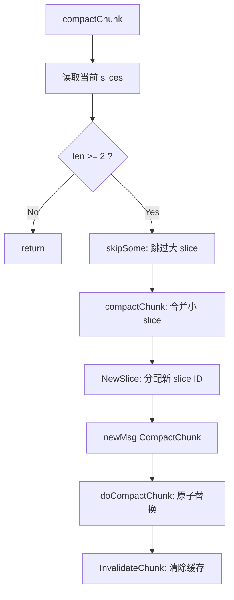

# pkg/vfs 模块分析

## 职责
`pkg/vfs` 是 FUSE 协议与 JuiceFS 内部逻辑的适配层。它实现了 FUSE 的所有文件系统操作，并维护了内核最关心的状态——**文件句柄 (File Handle)**。

**源码位置**: `pkg/vfs/` 目录

## 核心文件结构

| 文件 | 职责 |
|:-----|:-----|
| `vfs.go` | VFS 主结构体定义和 FUSE 操作入口 |
| `handle.go` | 文件句柄管理 |
| `reader.go` | 文件读取逻辑 |
| `writer.go` | 文件写入逻辑 |
| `compact.go` | Chunk 压缩逻辑 |
| `internal.go` | 内部特殊节点 (控制文件、状态文件) |
| `accesslog.go` | 访问日志记录 |

## 核心结构体

### VFS 主结构体
`VFS` 是整个 VFS 层的入口，持有 Meta、ChunkStore 以及句柄表：

```go
// pkg/vfs/vfs.go (推断自代码分析)
type VFS struct {
    Meta    meta.Meta         // 元数据引擎
    Store   chunk.ChunkStore  // 数据存储
    Conf    *Config           // 配置

    // 句柄管理
    hanleM    sync.Mutex
    handles   map[Ino][]*handle  // inode -> handles 映射
    handleIno map[uint64]Ino     // fh -> inode 反向映射
    nextfh    uint64             // 下一个可用的 fh

    // 读写器
    reader    DataReader
    writer    DataWriter
}
```

### handle (文件句柄)
```go
// pkg/vfs/handle.go:32-61
type handle struct {
    sync.Mutex
    inode Ino
    fh    uint64

    // 目录句柄
    dirHandler meta.DirHandler
    readAt     time.Time

    // 文件句柄
    flags      uint32
    locks      uint8
    flockOwner uint64  // BSD 锁所有者
    ofdOwner   uint64  // OFD 锁
    reader     FileReader
    writer     FileWriter
    ops        []Context  // 正在进行的操作

    // 读写锁
    writing uint32
    readers uint32
    writers uint32
    cond    *utils.Cond

    // 内部文件
    off     uint64
    data    []byte
    pending []byte
    bctx    meta.Context
}
```

### FileReader 接口
```go
// pkg/vfs/reader.go:69-73
type FileReader interface {
    Read(ctx meta.Context, off uint64, buf []byte) (int, syscall.Errno)
    GetLength() uint64
    Close(ctx meta.Context)
}
```

### FileWriter 接口
```go
// pkg/vfs/writer.go:35-41
type FileWriter interface {
    Write(ctx meta.Context, offset uint64, data []byte) syscall.Errno
    Flush(ctx meta.Context) syscall.Errno
    Close(ctx meta.Context) syscall.Errno
    GetLength() uint64
    Truncate(length uint64)
}
```

### DataReader / DataWriter 接口
```go
// pkg/vfs/reader.go:75-79
type DataReader interface {
    Open(inode Ino, length uint64) FileReader
    Truncate(inode Ino, length uint64)
    Invalidate(inode Ino, off, length uint64)
}

// pkg/vfs/writer.go:43-50
type DataWriter interface {
    Open(inode Ino, fleng uint64) FileWriter
    Flush(ctx meta.Context, inode Ino) syscall.Errno
    GetLength(inode Ino) uint64
    Truncate(inode Ino, length uint64)
    UpdateMtime(inode Ino, mtime time.Time)
    FlushAll() error
}
```

## 关键流程

### 打开文件 (Open)
```go
// pkg/vfs/handle.go:237-252
func (v *VFS) newFileHandle(inode Ino, length uint64, flags uint32) uint64 {
    h := v.newHandle(inode, (flags&O_ACCMODE) == syscall.O_RDONLY)
    h.Lock()
    defer h.Unlock()
    h.flags = flags
    switch flags & O_ACCMODE {
    case syscall.O_RDONLY:
        h.reader = v.reader.Open(inode, length)
    case syscall.O_WRONLY:
        fallthrough  // FUSE writeback_cache 模式下也需要 reader
    case syscall.O_RDWR:
        h.reader = v.reader.Open(inode, length)
        h.writer = v.writer.Open(inode, length)
    }
    return h.fh
}
```

### 查找操作 (Lookup)
```go
// pkg/vfs/vfs.go:176-200
func (v *VFS) Lookup(ctx Context, parent Ino, name string) (entry *meta.Entry, err syscall.Errno) {
    var inode Ino
    var attr = &Attr{}

    // 处理内部特殊节点
    if parent == rootID || name == internalNodes[0].name {
        n := getInternalNodeByName(name)
        if n != nil {
            entry = &meta.Entry{Inode: n.inode, Attr: n.attr}
            return
        }
    }

    // 调用元数据引擎
    err = v.Meta.Lookup(ctx, parent, name, &inode, attr, true)
    if err == 0 {
        entry = &meta.Entry{Inode: inode, Attr: attr}
    }
    return
}
```

### 读操作分发
```
vfs.Read(fh, ...)
    -> findHandle(inode, fh)
    -> handle.reader.Read(ctx, offset, buf)
    -> sliceReader.ReadAt(...)  // 在 reader.go 中
    -> chunk.ReadAt(...)        // 最终调用 ChunkStore
```

### 写操作分发
```
vfs.Write(fh, ...)
    -> findHandle(inode, fh)
    -> handle.writer.Write(ctx, offset, data)
    -> sliceWriter.WriteAt(...)  // 在 writer.go 中
    -> chunk.Writer.WriteAt(...) // 最终调用 ChunkStore
```

## 读取器状态机 (SliceReader)

```go
// pkg/vfs/reader.go:34-50
/*
 * state of sliceReader
 *
 *    <-- REFRESH
 *   |      |
 *  NEW -> BUSY  -> READY
 *          |         |
 *        BREAK ---> INVALID
 */
const (
    NEW = iota
    BUSY
    REFRESH
    BREAK
    READY
    INVALID
)
```

状态说明：
- **NEW**: 初始状态
- **BUSY**: 正在读取数据
- **REFRESH**: 需要刷新（数据可能已过期）
- **BREAK**: 读取中断
- **READY**: 数据就绪
- **INVALID**: 数据无效（需要重新读取）

## 句柄并发控制

句柄实现了读写锁机制来保护并发访问：

```go
// pkg/vfs/handle.go:101-148
func (h *handle) Rlock(ctx Context) bool {
    h.Lock()
    for (h.writing | h.writers) != 0 {
        if h.cond.WaitWithTimeout(time.Second) && ctx.Canceled() {
            h.Unlock()
            return false
        }
    }
    h.readers++
    h.Unlock()
    return true
}

func (h *handle) Wlock(ctx Context) bool {
    h.Lock()
    h.writers++
    for (h.readers | h.writing) != 0 {
        if h.cond.WaitWithTimeout(time.Second) && ctx.Canceled() {
            h.writers--
            h.Unlock()
            return false
        }
    }
    h.writers--
    h.writing = 1
    h.Unlock()
    return true
}
```

## 状态恢复 (热升级)

JuiceFS 支持热升级，VFS 层负责句柄状态的序列化与恢复：

### 保存状态
```go
// pkg/vfs/handle.go:299-369
func (v *VFS) dumpAllHandles(path string) error {
    v.hanleM.Lock()
    defer v.hanleM.Unlock()

    var vfsState state
    vfsState.Handler = make(map[uint64]saveHandle)

    for ino, hs := range v.handles {
        for _, h := range hs {
            h.Lock()
            // 如果有 writer，先 Flush
            if h.writer != nil {
                _ = h.writer.Flush(meta.Background())
            }
            // 保存句柄状态
            s := saveHandle{
                Inode:      uint64(h.inode),
                Length:     length,
                Flags:      h.flags,
                UseLocks:   h.locks,
                FlockOwner: h.flockOwner,
                // ...
            }
            vfsState.Handler[h.fh] = s
            h.Unlock()
        }
    }

    // 序列化为 JSON 并写入文件
    d, _ := json.Marshal(vfsState)
    return os.WriteFile(path, d, 0644)
}
```

### 恢复状态
```go
// pkg/vfs/handle.go:371-426
func (v *VFS) loadAllHandles(path string) error {
    // 从文件读取 JSON
    d, _ := os.ReadFile(path)
    var vfsState state
    json.Unmarshal(d, &vfsState)

    // 恢复句柄
    for fh, s := range vfsState.Handler {
        h := &handle{
            inode:      Ino(s.Inode),
            fh:         fh,
            flags:      s.Flags,
            // ...
        }
        // 重建 reader/writer
        switch s.Flags & O_ACCMODE {
        case syscall.O_RDONLY:
            h.reader = v.reader.Open(h.inode, s.Length)
        case syscall.O_RDWR:
            h.reader = v.reader.Open(h.inode, s.Length)
            h.writer = v.writer.Open(h.inode, s.Length)
        }
        v.handles[h.inode] = append(v.handles[h.inode], h)
    }
    return nil
}
```

## 内部特殊节点

JuiceFS 在 VFS 层维护了一些内部特殊节点 (`pkg/vfs/internal.go`)：
- **控制文件** (`.control`): 用于 CLI 命令交互
- **状态文件** (`.stats`): 导出性能指标
- **日志文件** (`.accesslog`): 访问日志

## 配置结构

```go
// pkg/vfs/vfs.go:124-156
type Config struct {
    Meta                 *meta.Config
    Format               meta.Format
    Chunk                *chunk.Config
    Security             *SecurityConfig
    Port                 *Port
    Version              string
    AttrTimeout          time.Duration  // 属性缓存超时
    DirEntryTimeout      time.Duration  // 目录项缓存超时
    NegEntryTimeout      time.Duration  // 负缓存（不存在）超时
    EntryTimeout         time.Duration  // 条目缓存超时
    ReaddirCache         bool
    BackupMeta           time.Duration
    FastResolve          bool
    AccessLog            string
    Subdir               string
    PrefixInternal       bool
    HideInternal         bool
    RootSquash           *AnonymousAccount
    AllSquash            *AnonymousAccount
    NonDefaultPermission bool
    UMask                uint16
    Mountpoint           string
    // ...
}
```

## Rust 重写思考

### 库选型：`fuse-backend-rs`
相比 `fuser`，阿里开源的 [fuse-backend-rs](https://github.com/dragonflyoss/fuse-backend-rs) 更适合生产级存储系统：
- 支持多线程模型
- 抽象了 `FileSystem` trait
- 未来可扩展到 virtio-fs

### 并发模型
```rust
use dashmap::DashMap;
use tokio::sync::RwLock;

struct VFS {
    meta: Arc<dyn MetaEngine>,
    store: Arc<dyn ChunkStore>,
    handles: DashMap<Ino, Vec<Arc<Handle>>>,
}

struct Handle {
    inode: Ino,
    fh: u64,
    reader: Option<RwLock<FileReader>>,
    writer: Option<RwLock<FileWriter>>,
    rw_lock: RwLock<()>,  // 读写互斥
}
```

### 模块解耦
建议将 VFS 拆分为：
- **InodeManager**: 处理 `Lookup`, `GetAttr`, `SetAttr` 等元数据操作
- **HandleManager**: 处理 `Open`, `Release`, `Read`, `Write` 等 IO 操作
- **InternalNodes**: 处理特殊内部节点

### 状态机实现
```rust
#[derive(Clone, Copy, PartialEq)]
enum SliceState {
    New,
    Busy,
    Refresh,
    Break,
    Ready,
    Invalid,
}

impl SliceState {
    fn is_valid(&self) -> bool {
        !matches!(self, SliceState::Break | SliceState::Invalid)
    }
}
```

## 待深入研究
- [x] 句柄管理机制：已完成分析
- [x] 热升级状态恢复：已完成分析
- [x] WriterBack 模式：已完成分析
- [x] 内核缓存失效：已完成分析
- [x] Compact 逻辑：已完成分析

---

## FUSE writeback_cache 模式

### 原理
FUSE 的 `writeback_cache` 选项启用内核级写缓冲。内核会将写操作缓存在 page cache 中，而不是立即发送给用户态文件系统。

### 配置方式
```bash
juicefs mount -o writeback_cache meta://... /mnt/jfs
```

### JuiceFS 适配
```go
// pkg/fuse/fuse.go:499-500
} else if n == "writeback_cache" {
    opt.EnableWriteback = true
}
```

### 关键设计：WRONLY 也需要 reader
```go
// pkg/vfs/handle.go:245-249
case syscall.O_WRONLY: // FUSE writeback_cache mode need reader even for WRONLY
    fallthrough
case syscall.O_RDWR:
    h.reader = v.reader.Open(inode, length)
    h.writer = v.writer.Open(inode, length)
```

**原因**: 在 writeback_cache 模式下，内核可能对只写打开的文件发起读请求（用于 page cache 对齐），因此 JuiceFS 必须为 O_WRONLY 也创建 reader。

### 数据失效处理
```go
// pkg/vfs/vfs.go:863
v.reader.Invalidate(ino, off, size)  // 写入后使读缓存失效
```

---

## 内核缓存失效机制

### 目录项失效 (Entry Invalidation)
JuiceFS 使用 FUSE 的 `EntryNotify` 接口通知内核使目录项缓存失效：

```go
// pkg/fuse/fuse.go:533-535 (仅 Linux)
if runtime.GOOS == "linux" {
    v.InvalidateEntry = func(parent Ino, name string) syscall.Errno {
        return syscall.Errno(fssrv.EntryNotify(uint64(parent), name))
    }
}
```

### 使用场景
```go
// pkg/vfs/internal.go:324-327 (删除操作后)
if st == 0 && v.InvalidateEntry != nil {
    if st := v.InvalidateEntry(inode, name); st != 0 {
        logger.Warnf("Invalidate entry %d/%s: %s", inode, name, st)
    }
}
```

### Chunk 缓存失效
```go
// pkg/vfs/vfs.go:864
v.invalidateAttr(ino)  // 使属性缓存失效

// pkg/meta/base.go:1972
m.of.InvalidateChunk(inode, indx)  // Truncate 后使 Chunk 缓存失效
```

### 失效类型总结
| 类型 | 触发时机 | 接口 |
|:-----|:---------|:-----|
| Entry | 删除/重命名后 | `fssrv.EntryNotify` |
| Attr | 写入/truncate 后 | `invalidateAttr` |
| Chunk | 写入/truncate/compact 后 | `InvalidateChunk` |

---

## Chunk Compact 逻辑

### 触发条件
```go
// pkg/meta/base.go:1928-1929 (读取时)
if !m.conf.ReadOnly && (len(ss) >= 5 || len(*slices) >= 5) {
    go m.compactChunk(inode, indx, false, false)
}

// pkg/meta/base.go:1982-1987 (写入时)
if numSlices%100 == 99 || numSlices > 350 {
    if numSlices < maxSlices {
        go m.compactChunk(inode, indx, false, false)  // 异步
    } else {
        m.compactChunk(inode, indx, true, false)      // 同步阻塞
    }
}
```

### 去重机制
```go
// pkg/meta/base.go:2578-2602
func (m *baseMeta) compactChunk(inode Ino, indx uint32, once, force bool) {
    k := uint64(inode) + (uint64(indx) << 40)  // 唯一 key
    m.Lock()
    if once || force {
        for m.compacting[k] {  // 等待已有压缩完成
            m.Unlock()
            time.Sleep(time.Millisecond * 10)
            m.Lock()
        }
    } else if len(m.compacting) > 10 || m.compacting[k] {
        m.Unlock()
        return  // 跳过：已在压缩或压缩任务过多
    }
    m.compacting[k] = true
    // ...
}
```

### 压缩流程


### skipSome 算法
跳过不需要压缩的大 slice：
```go
// pkg/meta/slice.go:183-210
func skipSome(chunk []*slice) int {
    var skipped int
    for skipped < len(chunk) {
        first := chunk[skipped]
        // 条件：slice 足够大 (>1MB) 且占总大小的 20% 以上
        if first.len < (1<<20) || first.len*5 < size {
            break
        }
        // 确保是第一个有效 slice
        if !isFirst(pos, c[0]) {
            break
        }
        skipped++
    }
    return skipped
}
```

### Slice 合并 (buildSlice)
使用二叉树结构处理 slice 重叠：
```go
// pkg/meta/slice.go:134-155
func buildSlice(ss []*slice) []Slice {
    var root *slice
    for i := range ss {
        s := new(slice)
        *s = *ss[i]
        // cut: 处理重叠部分
        s.left, right = root.cut(s.pos)
        _, s.right = right.cut(s.pos + s.len)
        root = s
    }
    // 中序遍历生成最终 slice 列表
    root.visit(func(s *slice) {
        chunk = append(chunk, Slice{Id: s.id, Size: s.size, Off: s.off, Len: s.len})
    })
    return chunk
}
```

### 手动触发
```bash
# 压缩单个文件
juicefs compact /mnt/jfs/path/to/file

# 压缩整个文件系统
juicefs gc --compact meta://...
```
